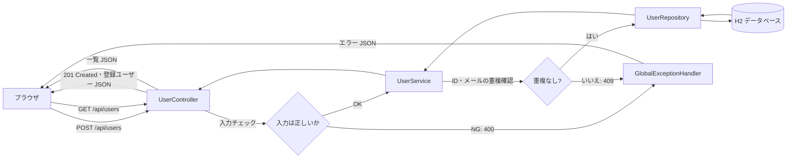

# Cafeteria

ユーザー登録と登録済みユーザーの一覧表示を行う Spring Boot アプリケーションです。

## システムの流れ

1. ブラウザで `http://localhost:8080/` を開くと、`static/index.html` の登録フォームが表示されます。
2. 「学籍/教職員 ID・氏名・メールアドレス・区分」を入力して登録すると、画面は `POST /api/users` を送信します。
3. `UserController` が入力を検証し、`UserService` が ID とメールアドレスの重複を確認します。
4. 重複がなければ `UserRepository` を通じて H2 の `cafeteria_users` テーブルへ保存し、登録結果を返します。入力不備は `400`、ID またはメールアドレスの重複は `409` を返します。
5. 画面は `GET /api/users` で一覧を再取得し、ID・氏名・区分・メールアドレスを表示します。

H2 はメモリ上のデータベースのため、アプリケーションを停止すると登録データは消えます。

## エンドポイント

| 操作 | HTTP | URL | 内容 |
| --- | --- | --- | --- |
| 画面表示 | GET | `/` | ユーザー登録フォームと一覧 |
| ユーザー登録 | POST | `/api/users` | ID・氏名・メールアドレス・区分を登録 |
| 一覧取得 | GET | `/api/users` | 登録済みユーザーを返却 |
| DB 確認 | GET | `/h2-console` | H2 コンソール |

このプロジェクトは Maven、Java 21、Spring Boot 3.2.4 を使用します。

## IntelliJ IDEA での実行

1. IntelliJ IDEA でプロジェクト直下の `pom.xml` を開き、Maven プロジェクトとして読み込みます。
2. **File > Project Structure > Project SDK** で Java 21（例: `corretto-21.0.5`）を選択します。
3. Maven ツールウィンドウで再読み込みした後、`CafeteriaApplication` を実行します。

IntelliJ IDEA 付属の Maven を利用できるため、ローカルに `mvn` コマンドを別途インストールする必要はありません。
